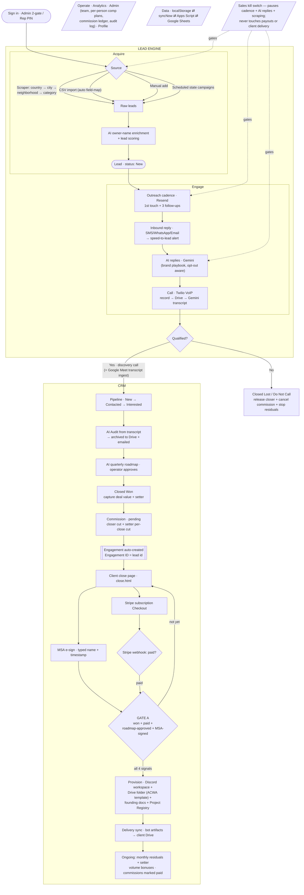

# AXIUS Lead Engine & CRM — End-to-End Lifecycle

How a record travels from a cold target to a delivered, paying client. The **Lead Engine** generates and warms demand; the **CRM** closes it and runs delivery on one immutable **Engagement ID** (= the lead id).



## External systems by stage
| Stage | Systems |
|---|---|
| Acquire | Google Places API · Gemini (owner enrichment) |
| Engage | Resend (email cadence) · Twilio (calls/SMS/WhatsApp) · Gemini (AI replies, transcription) |
| Close | Google Drive (audit/MSA archive) · Stripe (subscription + webhook) |
| Provision | Discord bot (`bot.axius.tech`) · Google Drive · Project Registry (Google Sheet) |
| Throughout | Google Apps Script ⇄ Google Sheets (system of record) |

## Invariants the flow guarantees
- **One Engagement ID** (= the lead id) carries the record from Closed Won through delivery — no re-keying.
- **Gate A** needs all four signals (won + paid + roadmap-approved + MSA-signed); the close page loops until then, and provisioning only fires once.
- **Money is server-authoritative**: close-page amounts come from the tier, and the Stripe webhook (own token, re-fetched event) is the only trusted "paid" signal.
- **Closed Lost / DNC** always releases the closer, cancels the pending commission, and stops residuals — single-lead, pipeline, and bulk paths included.
- **The kill switch** pauses only outbound activity (scraping, cadence, AI replies); payouts and client delivery keep running.

## Plain-text sequence (fallback)
```
Sign in → Acquire (scrape / import / campaign → enrich → score → Lead:New)
  → Engage (cadence → inbound → AI reply → call/transcript) → Qualified?
     → No  → Closed Lost / DNC (release + cancel)
     → Yes → Pipeline → AI Audit → AI Roadmap → Closed Won (deal + setter)
            → Commission pending → Engagement created
            → Close page (MSA e-sign + Stripe pay → webhook paid)
            → GATE A (won+paid+roadmap+MSA)
               → Provision (Discord + Drive ACWA + Registry)
               → Delivery sync → ongoing residuals + bonuses + paid commissions
```
