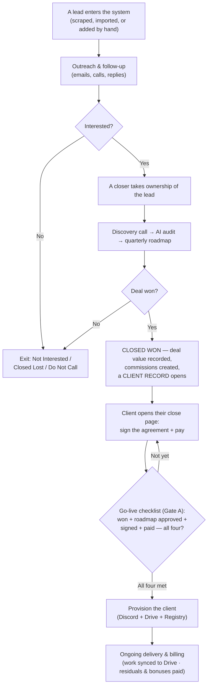
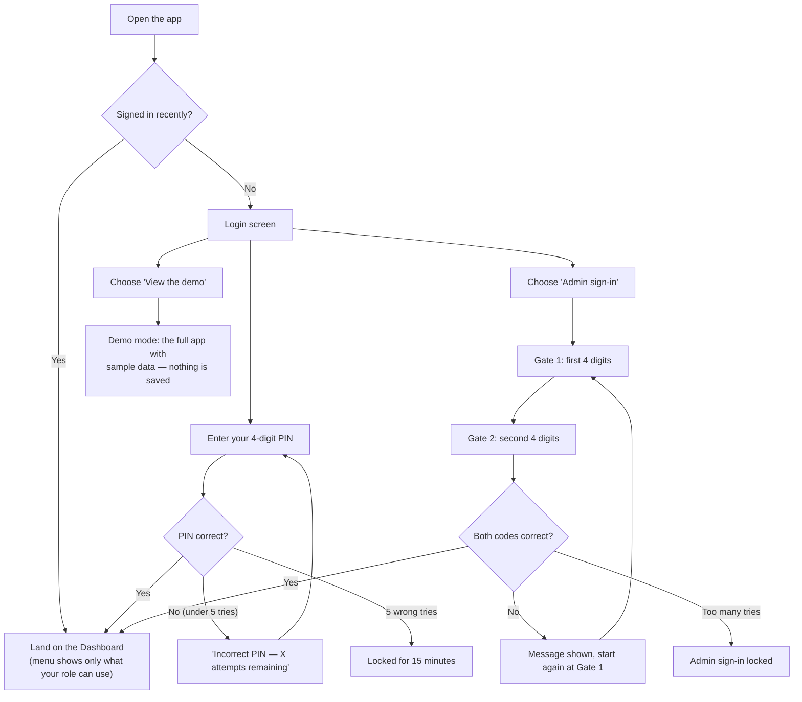
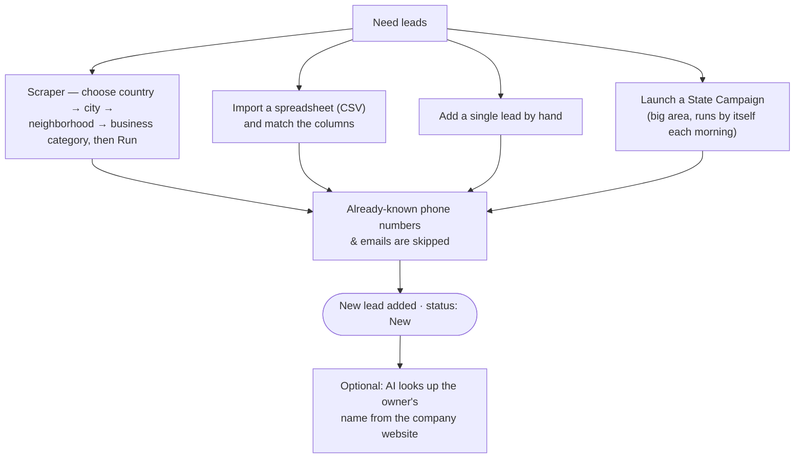
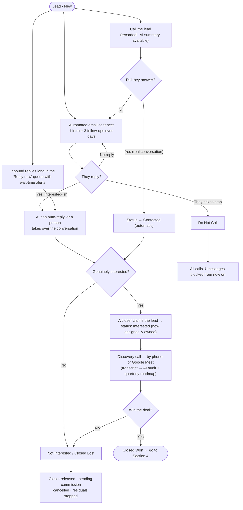
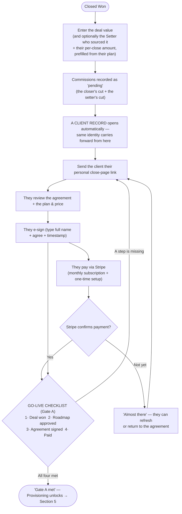
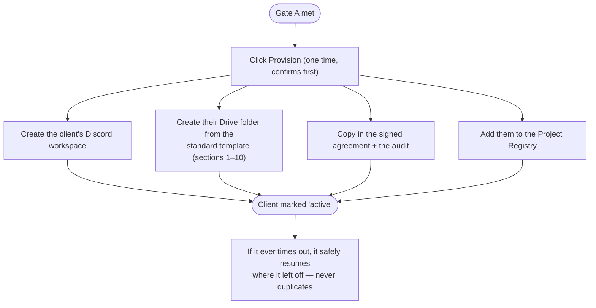
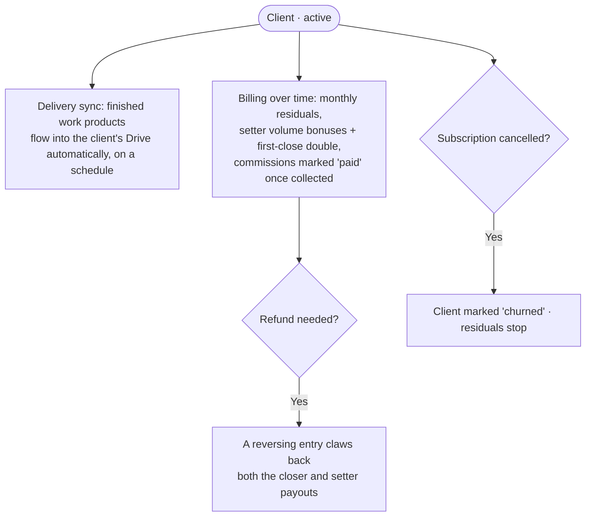

# AXIUS Lead Engine & CRM — Complete UX Flow

A plain‑language walkthrough of the whole product, in order, with **every route** a person can take and every point where work **begins, happens, or hands off** to the next person or system. Read it top to bottom and you've followed a stranger from a cold name on a map to a live, paying, fully set‑up client.

The system has two halves:
- **Lead Engine** — finds people and warms them up.
- **CRM** — closes them and runs the delivery relationship.

One thing ties it together: the **client's identity is created once and never changes**. The same record carries from the first email through to their Discord and Drive.

---

## 0 · The journey at a glance

---

## 1 · Getting in (entry & access)

Every visit starts here.

**Routes in plain terms**
- **Team member:** type your 4‑digit PIN. Wrong PIN shows how many tries are left; five wrong locks you out for 15 minutes.
- **Admin:** a two‑step code (first four digits, then four more). A wrong code sends you back to step one with a message; too many tries locks admin sign‑in separately.
- **Demo:** "View the demo" opens the whole product filled with sample data so anyone can explore it. Nothing is saved, and a refresh returns to the login screen.
- **A brand‑new device** needs no setup — the first successful sign‑in quietly configures that browser for good.
- **Idle protection:** after 30 minutes of no activity you get a 2‑minute warning, then you're signed out automatically.

**What each role can reach once inside**

| Role | What they see |
|---|---|
| **Admin** | Everything — leads, pipeline, calls, replies, outreach, scraper, import/export, analytics, admin, settings |
| **Closer** | Dashboard, Leads, Pipeline, Calls, Reply‑now, Profile |
| **Appointment Setter** | Dashboard, Leads, Calls, Reply‑now, Profile (no Pipeline) |
| **Solo operator** | Everything a Closer sees, plus Analytics |

---

## 2 · Lead Engine — getting leads in (Acquire)

A lead can enter the system four ways. However it arrives, duplicates are skipped automatically and it lands as a brand‑new lead.

**Each route, step by step**
- **Scraper:** pick a country, then city, then neighborhood, then a business type, set a radius and a max count, and press Run. Results come back, duplicates drop out, and the rest are added. A small history of past scrapes is kept.
- **CSV import:** drag in a spreadsheet. The app guesses which column is name, phone, email, etc.; you confirm the mapping; it shows you how many are new vs. duplicates; you press confirm.
- **Add by hand:** a quick form — you only need a name **or** a phone **or** an email.
- **State Campaign:** choose a whole state and an industry; the system then scrapes a little each morning over many days, adding leads as it goes. You can pause, resume, or run it now.
- **Owner enrichment:** at any time, AI can read a lead's website and fill in the owner's name — one lead, or a batch.

> **This is where a lead's life begins.** It enters as **New** and belongs to no one yet.

---

## 3 · Lead Engine — warming them up (Engage)

Now the lead gets worked. Several routes run in parallel, and the lead's **status** moves as things happen.

**The outbound channels**
- **Email cadence:** an intro email followed by three brand‑voice follow‑ups, spaced over days, within quiet hours. The admin runs it **live** or in **simulation** (shows what *would* send). It stops on its own when the lead replies, opts out, is claimed, or is closed.
- **AI replies:** when a lead writes back, AI can answer in the brand voice (only offering a booking link once there's interest) — until a human steps in, which automatically pauses the AI.
- **Reply‑now queue:** every inbound message (email, and SMS/WhatsApp once enabled) shows up here, oldest‑waiting first, with a beep/notification so no one is left hanging.
- **Calls:** dial → it rings → they answer → the call records → you hang up and log the outcome (**Answered, No answer, Voicemail, Busy, Call back, Wrong number, Other**). You can then have it transcribed and summarized by AI. The first real (answered) call moves a lead from **New → Contacted** automatically.
- **Discovery call:** the qualifying conversation, by phone or Google Meet. A Meet transcript can be pasted in and is summarized by AI — and that summary feeds the audit and the roadmap.

**The status ladder (and what each move does)**

| Status | When it happens | What it triggers |
|---|---|---|
| **New** | The moment the lead is added | Eligible for the email cadence |
| **Contacted** | First answered call | Cadence keeps going; no longer "untouched" |
| **Interested** | A closer claims it | **Ownership transfers to that closer**; the lead is locked to them |
| **Closed Won** | A deal is agreed | Deal value captured, commissions created, **a client record opens** (Section 4) |
| **Closed Lost** | The deal dies | Closer released, pending commission cancelled, residuals stopped |
| **Not Interested** | They decline | Outreach stops |
| **Do Not Call** | They opt out (reason required) | All future contact blocked; only an admin can delete the lead |

> **The first human handoff happens at "Interested":** the lead transfers from the outreach machine to a named closer who now owns it.

---

## 4 · CRM — closing the deal

Marking a lead **Closed Won** opens the close flow. This is the seam where sales becomes delivery.

**What the prospect can land on (their close page)**
- **"Almost ready"** — the agreement isn't configured yet; nothing for them to do.
- **Review & sign** — the agreement text, the plan and price, a name field and an agree box.
- **Pay** — after signing, they're sent to Stripe to subscribe (any promo/waiver code is entered there, never shown on the page).
- **"Almost there"** — they came back from Stripe but payment isn't confirmed yet.
- **"You're all set"** — signed and paid; done.

**Money created at the close** — commissions start as **pending**: the closer's cut, and (if a setter sourced it) the setter's per‑close amount. The setter is recorded as the lead's source so their monthly residuals and bonuses can be credited later.

**The go‑live checklist (Gate A)** — a client only becomes provisionable when **all four** are true:
1. **Deal won** (true the moment the client record opens)
2. **Roadmap approved** — AI drafts a quarterly roadmap; the operator approves it
3. **Agreement signed** — the client e‑signs the MSA
4. **Paid** — Stripe confirms (the webhook is the trusted signal; a "paid" flag can't be faked)

> **Two handoffs happen here.** At **Closed Won** the lead *becomes a client record* — the sales‑to‑delivery handoff begins, and the same identity now carries through every system. On the **close page**, commitment transfers to the client themselves: they sign and pay.

---

## 5 · CRM — turning on the client (Provision)

When Gate A is met, a **Provision** button appears. One click sets the client up everywhere (it can't be auto‑undone, so it asks to confirm).

In one action the client gets their **Discord** space, their **Drive** folder built from the standard template with the founding documents filed in the right place, and a row in the central **Project Registry**. Their record is then marked **active**.

> **This is the transfer into delivery.** The client moves out of the sales pipeline and into the live systems where the work actually happens.

---

## 6 · CRM — running the relationship (Deliver & operate)

- **Delivery sync** — work products staged by the delivery side post themselves into the client's Drive, in the right section, on a schedule.
- **Paying people** — residuals accrue monthly; setters earn volume bonuses and a first‑close‑of‑the‑month double; the admin marks commissions **paid** once money is actually collected (with a warning if the *client* hasn't paid yet). A **refund** creates a reversing entry that pulls back both the closer's and the setter's payouts.
- **If a client cancels** their subscription, they're marked **churned** and residuals stop.

---

## 7 · Controls that apply everywhere

- **Sales kill switch** (Admin → Operations): one toggle **pauses all outbound activity at once** — scraping, email cadence, and AI replies, whether scheduled or run by hand — until an admin resumes it. It deliberately **does not** touch payouts or client delivery, so existing clients are never affected.
- **Works offline:** everything you do is saved on your device first and synced to the central record in the background; a failed save is kept and retried, so nothing is silently lost.
- **Live status cues:** a sync indicator, a storage meter, and pop‑up messages keep everyone informed; the idle warning protects an unattended screen.

---

## 8 · When things begin, happen, and transfer (the handoffs)

The single most important thread in the whole product — read this as the "ownership relay."

| Moment | What happens | What transfers, and to whom |
|---|---|---|
| **Lead created** | Scraped, imported, or added | A new lead **begins**, owned by no one |
| **First answered call** | Status moves to Contacted | — |
| **Marked Interested** | A closer claims the lead | **Ownership → that closer** (locked to them) |
| **Closed Won** | Deal value entered, commissions created | The lead **becomes a client record** — the sales→delivery handoff begins; one identity now carries forward |
| **Close page** | Client signs & pays | Commitment **transfers to the client**; Stripe confirms the money |
| **Gate A met** | All four checks true | Go‑live unlocks |
| **Provision** | Discord + Drive + Registry created | The client **transfers into the delivery systems** |
| **Delivery sync (ongoing)** | Work products posted | Deliverables **transfer into the client's Drive**, continuously |
| **Refund / cancellation** | Reversing entry / churn | Payouts reverse; residuals stop |

---

*Two halves, one identity: the **Lead Engine** carries a stranger from a name on a map to a qualified, interested prospect; the **CRM** carries that prospect from a signed, paid agreement to a fully set‑up, actively delivered client — and pays everyone correctly along the way.*
